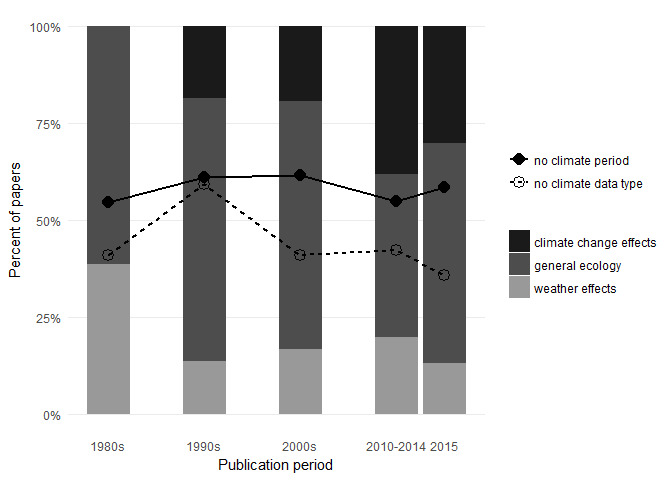

Climate data reporting analysis
================
September 29 2017

Analysis of climate reporting practices in published ecology studies
--------------------------------------------------------------------

Morueta-Holme N, Oldfather MF, Olliff-Yang R, Weitz AP, Levine CR, Kling M, Riordan EC, Merow C, Sheth SN, Thornhill AH, Ackerly DD

### 0. Prepare data

Load libraries

``` r
#rm(list=ls())
require(ggplot2)
require(dplyr)
require(gmodels)
require(tidyr)
```

Read in the data and select relevant columns

``` r
rawData1 = read.csv('Climate_reporting_dataset1.csv', as.is=T) 
rawData2 = read.csv('Climate_reporting_dataset2.csv', as.is=T)

# Select papers that are OK for analysis, and the relevant columns
df1 = rawData1[,c('ID','publication_year','journal','study_focus','geographic_extent_of_study','tense_description','climate_date_range','climate_data_source','citation_type','description_access_to_source','source_sufficient')]

df2 = rawData2[,c('ID','publication_year','journal','study_focus','geographic_extent_of_study','tense_description','climate_date_range','climate_data_source','citation_type','description_access_to_source','source_sufficient')]
                    
#merge the two tables
df = rbind(df1,df2)
rm(rawData1,rawData2,df1,df2)

#lump continental and global categories
df$geographic_extent_of_study[which(df$geographic_extent_of_study=='continental' | df$geographic_extent_of_study=='global')] = 'continental/global'


#Rename date range to 'yes/no'
df$climate_date_range[which(df$climate_date_range==TRUE)] = 'yes'
df$climate_date_range[which(df$climate_date_range==FALSE)] = 'no'
```

### 1. General summaries

What is the distribution of geographic extent of study across papers?

``` r
ExtentSum <-
  df %>%
  group_by(geographic_extent_of_study) %>%
  summarise(n=n()) %>%
  mutate(rel.freq = round(100*n/sum(n), 0))
ExtentSum
```

    #> # A tibble: 3 × 3
    #>   geographic_extent_of_study     n rel.freq
    #>                        <chr> <int>    <dbl>
    #> 1         continental/global    40       13
    #> 2                   regional    98       32
    #> 3                       site   167       55

What is the distribution of study focus across papers?

``` r
FocusSum <-
  df %>%
  group_by(study_focus) %>%
  summarise(n=n()) %>%
  mutate(rel.freq = round(100*n/sum(n), 0))
FocusSum
```

    #> # A tibble: 3 × 3
    #>              study_focus     n rel.freq
    #>                    <chr> <int>    <dbl>
    #> 1 climate change effects    69       23
    #> 2        general ecology   177       58
    #> 3        weather effects    59       19

How many papers provide climate date range?

``` r
DateRangeSum <-
  df %>%
  group_by(climate_date_range) %>%
  summarise(n=n()) %>%
  mutate(rel.freq = round(100*n/sum(n), 0))
DateRangeSum
```

    #> # A tibble: 2 × 3
    #>   climate_date_range     n rel.freq
    #>                <chr> <int>    <dbl>
    #> 1                 no   178       58
    #> 2                yes   127       42

What are the types of climate data reported in the studies?

``` r
DataSource <-
  df %>%
  group_by(climate_data_source) %>%
  summarise(n=n()) %>%
  mutate(rel.freq = round(100*n/sum(n), 0))

DataSource
```

    #> # A tibble: 7 × 3
    #>   climate_data_source     n rel.freq
    #>                 <chr> <int>    <dbl>
    #> 1               atlas     4        1
    #> 2    multiple sources    35       11
    #> 3         name_of_GCM    25        8
    #> 4       not_specified   134       44
    #> 5            regional    10        3
    #> 6           site data    33       11
    #> 7        station data    64       21

### 2. Evalution of subset for detailed data source information

``` r
df_sub <- df[df$citation_type!='',]
```

What type of citation is given?

``` r
CitationSum <-
  df_sub %>%
  group_by(citation_type) %>%
  summarise(n=n()) %>%
  mutate(rel.freq = round(100*n/sum(n), 0))

CitationSum
```

    #> # A tibble: 13 × 3
    #>         citation_type     n rel.freq
    #>                 <chr> <int>    <dbl>
    #> 1       atlas or book     7        8
    #> 2            database     4        5
    #> 3  database and paper     8        9
    #> 4          incomplete     4        5
    #> 5            multiple     7        8
    #> 6                none    18       21
    #> 7        organization     5        6
    #> 8    own measurements     3        4
    #> 9               paper    13       15
    #> 10             report     8        9
    #> 11           software     1        1
    #> 12 software and paper     1        1
    #> 13   weather stations     6        7

Is there information on how to access the climate data?

``` r
AccessSum <-
  df_sub %>%
  group_by(description_access_to_source) %>%
  summarise(n=n()) %>%
  mutate(rel.freq = round(100*n/sum(n), 0))

AccessSum
```

    #> # A tibble: 2 × 3
    #>   description_access_to_source     n rel.freq
    #>                          <chr> <int>    <dbl>
    #> 1                           no    72       85
    #> 2                          yes    13       15

Is the citation given sufficient to retrieve the raw data?

``` r
CitationSuffSum <-
  df_sub %>%
  group_by(source_sufficient) %>%
  summarise(n=n()) %>%
  mutate(rel.freq = round(100*n/sum(n), 0))

CitationSuffSum
```

    #> # A tibble: 3 × 3
    #>   source_sufficient     n rel.freq
    #>               <chr> <int>    <dbl>
    #> 1                no    53       62
    #> 2           unclear    17       20
    #> 3               yes    15       18

If some sort of citation is given, is there also information on how to access the data?

``` r
SourceAccess
```

    #>      y
    #> x       no  yes
    #>   no  95.5  4.5
    #>   yes 81.0 19.0

### 3. Crosstabulations for evaluating reporting practices depending on study focus and geographic extent

#### Results across study focus

Climate data source given for papers with different study focus?

``` r
ResFocus1
```

    #>                         y
    #> x                        atlas multiple sources name_of_GCM not_specified
    #>   climate change effects   1.4             14.5        11.6          27.5
    #>   general ecology          1.1              7.9         8.5          56.5
    #>   weather effects          1.7             18.6         3.4          25.4
    #>                         y
    #> x                        regional site data station data
    #>   climate change effects      2.9       7.2         34.8
    #>   general ecology             3.4       9.0         13.6
    #>   weather effects             3.4      20.3         27.1

Climate date range given for papers with different study focus?

``` r
ResFocus2
```

    #>                         y
    #> x                          no  yes
    #>   climate change effects 31.9 68.1
    #>   general ecology        78.0 22.0
    #>   weather effects        30.5 69.5

#### Results across geographic extent

Climate data source given for different geographic extents?

``` r
ResExtent1
```

    #>                     y
    #> x                    atlas multiple sources name_of_GCM not_specified
    #>   continental/global   2.5             12.5        30.0          35.0
    #>   regional             3.1             17.3        13.3          37.8
    #>   site                 0.0              7.8         0.0          49.7
    #>                     y
    #> x                    regional site data station data
    #>   continental/global      2.5       2.5         15.0
    #>   regional                7.1       1.0         20.4
    #>   site                    1.2      18.6         22.8

Climate date range given for different geographic extents?

``` r
ResExtent2
```

    #>                     y
    #> x                      no  yes
    #>   continental/global 65.0 35.0
    #>   regional           53.1 46.9
    #>   site               59.9 40.1

Distribution of study foci across geographic extents?

``` r
ResExtent3
```

    #>                     y
    #> x                    climate change effects general ecology
    #>   continental/global                   27.5            60.0
    #>   regional                             33.7            45.9
    #>   site                                 15.0            64.7
    #>                     y
    #> x                    weather effects
    #>   continental/global            12.5
    #>   regional                      20.4
    #>   site                          20.4

### 4. Temporal analysis

Trends in reporting of type of climate data

``` r
SourcePeriod
```

    #>       y
    #> x      atlas multiple sources name_of_GCM not_specified regional site data
    #>   1980   0.0              9.1         0.0          40.9      0.0      31.8
    #>   1990   0.0              3.4         0.0          59.3      1.7      13.6
    #>   2000   2.6             16.7         3.8          41.0      9.0       5.1
    #>   2010   1.4             15.5        12.7          42.3      2.8       8.5
    #>   2015   1.9              9.4        24.5          35.8      0.0       1.9
    #>       y
    #> x      station data
    #>   1980         18.2
    #>   1990         22.0
    #>   2000         21.8
    #>   2010         16.9
    #>   2015         26.4

Trends in reporting of climate date range

``` r
RangePeriod
```

    #>       y
    #> x        no  yes
    #>   1980 54.5 45.5
    #>   1990 61.0 39.0
    #>   2000 61.5 38.5
    #>   2010 54.9 45.1
    #>   2015 58.5 41.5

Trends in focus of study

``` r
FocusPeriod
```

    #>       y
    #> x      climate change effects general ecology weather effects
    #>   1980                    0.0            61.4            38.6
    #>   1990                   18.6            67.8            13.6
    #>   2000                   19.2            64.1            16.7
    #>   2010                   38.0            42.3            19.7
    #>   2015                   30.2            56.6            13.2

### 5. Plot temporal trends



### 6. Tense used to describe climate?

When reporting or not reporting climate date ranges, what tense is used for describing climate?

``` r
DateTense
```

    #>      y
    #> x     implicit past implicit present inconsistent past present unclear
    #>   no            5.1             20.2          2.8  4.5    64.0     3.4
    #>   yes          33.1              3.1          8.7 35.4    17.3     2.4
